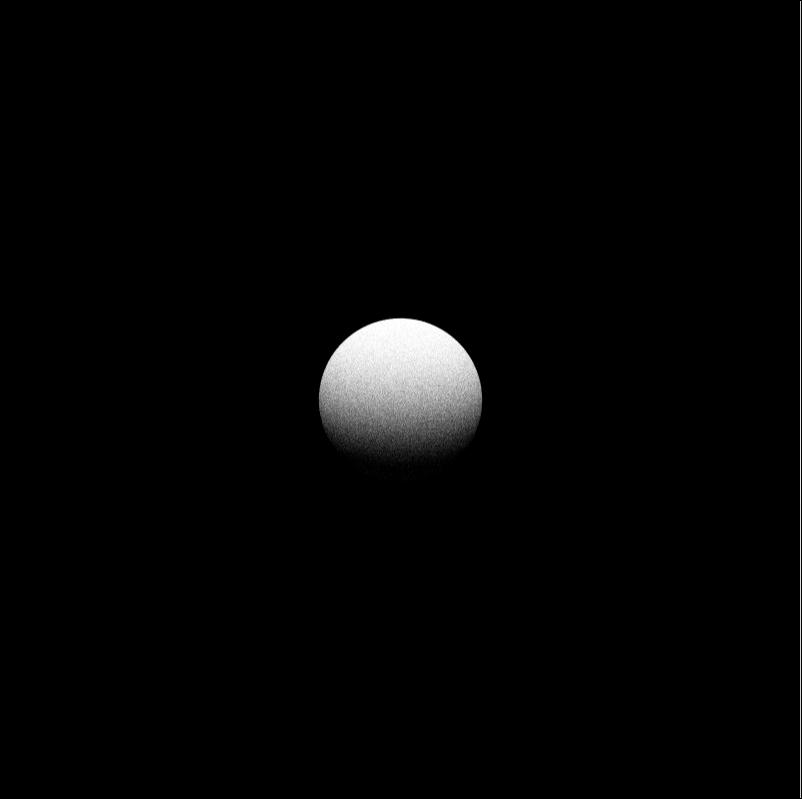

# liblight
a simple library to light up 3D scenes

{:height="100px" width="400px"}

## 1. How to build
Please use cmake to build liblight out-of-source.

	cd liblight
	mkdir _build && cd _build
	cmake ..
	make
	sudo make install

Enjoy it :)

## 2. How to use

	#include "../tools/math/inc/mathinc.h"
	#include "../inc/renderer-patht.hpp"
	#include "../inc/scene-tile.hpp"
	#include "../inc/camera-default.hpp"
	#include "../inc/material-default.hpp"
	
	using namespace Light;
	using namespace Light::Math;
	
	int main(int argc, char** argv)
	{
		TileScene scn;
		RdrrPathTracing rdr;
		Texture2D rt(Math::Resolution(100, 100));
	
		scn.add_material("mtrl0", std::make_shared<DefaultMaterial>());
	
		scn.add_shape(std::make_shared<Math::ShapeSphere>(Math::Point3(0, 0, 0), 10), "mtrl0");
		rdr.set_camera(std::make_shared<DefaultCamera>());
	
		rdr.render(rt, scn);
	
		return 0;
	}