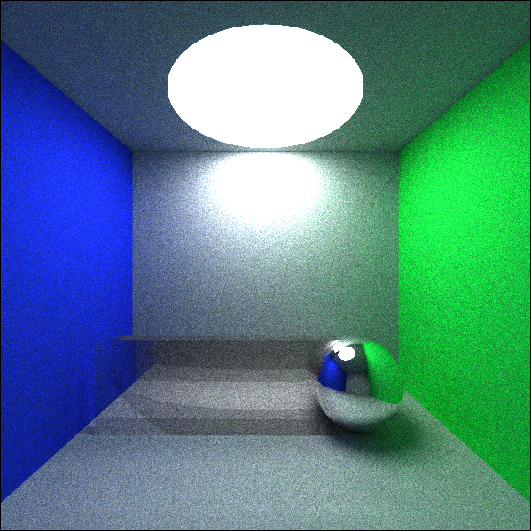

# liblight
a simple library to light up 3D scenes

## 1. How to build
Please use cmake to build liblight out-of-source.

	cd liblight
	mkdir _build && cd _build
	cmake ..
	make
	sudo make install

Enjoy it :)

## 2. How to use
	
	#include "../tools/math/inc/mathinc.h"
	#include "../inc/renderer-patht.hpp"
	#include "../inc/scene-tile.hpp"
	#include "../inc/camera-default.hpp"
	#include "../inc/material-default.hpp"
	#include "../inc/img-util.hpp"
	#include "../inc/tree.hpp"
	#include "../inc/readers/reader-simple.hpp"
	
	using namespace std;
	using namespace Light;
	using namespace Light::Math;
	
	int main(int argc, char** argv)
	{
		TileScene scn;
		RdrrPathTracing rdr(512);
		Texture2D rt(Math::Resolution(600, 600));
		shared_ptr<DefaultCamera> cam = make_shared<DefaultCamera>(10.0, 10.0);
		rdr.set_camera(cam);
	
		if (SimpleReader::parse_json(scn, "../../test/data/test-simple-rdr.json"))
		{
			rdr.render(rt, scn);
			
			ImgUtil::save_texture_as_ppm6("output.ppm", rt);
		}
	
		return 0;
	}