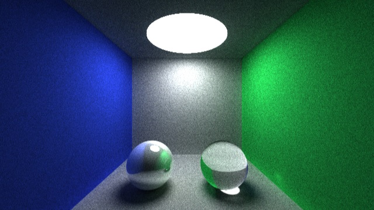

# liblight
a simple library to light up 3D scenes

## 1. How to build
Please use cmake to build liblight out-of-source.

	cd liblight
	mkdir _build && cd _build
	cmake ..
	make

## 2. How to use
		
**test/test-main.cpp**:

	#include "../tools/math/inc/mathinc.h"
	#include "../inc/renderer-patht.hpp"
	#include "../inc/scene-tile.hpp"
	#include "../inc/camera-default.hpp"
	#include "../inc/material-default.hpp"
	#include "../inc/img-util.hpp"
	#include "../inc/tree.hpp"
	#include "../inc/readers/reader-simple.hpp"
	
	using namespace std;
	using namespace Light;
	using namespace Light::Math;
	
	int main(int argc, char** argv)
	{
		TileScene scn;
		RdrrPathTracing rdr(2000, 6);
		Texture2D rt(Math::Resolution(600, 300));
	
		shared_ptr<DefaultCamera> cam = make_shared<DefaultCamera>(22.0, 11.0);
		rdr.set_camera(cam);
	
		if (SimpleReader::parse_json(scn, "../../test/data/cornell-box.json"))
		{
			rdr.render(rt, scn);
			
			ImgUtil::save_texture_as_ppm6("output.ppm", rt);
		}
	
		return 0;
	}

**test/data/cornell-box.json**:
	
	{
		  "mtrl_list" :
		[
			{
				  "type" : "default"
				, "name" : "white_obj"
				, "diffuse" : [0.8, 0.8, 0.8]
			}
			,{
				  "type" : "default"
				, "name" : "blue_obj"
				, "diffuse" : [0.2, 0.3, 1]
			}
			,{
				  "type" : "default"
				, "name" : "green_obj"
				, "diffuse" : [0.2, 1, 0.4]
			}
			,{
				  "type" : "default"
				, "name" : "white_light"
				, "emissive" : [8, 8, 8]
			}
			,{
				  "type" : "default"
				, "name" : "refrac_ball"
				, "refraction" : [1, 1, 1]
				, "IOR" : [1.3, 1, 1]
			}
			,{
				  "type" : "default"
				, "name" : "mirror_ball"
				, "specular" : [1, 1, 1]
			}
		]
		, "shape_list" :
		[
			{
				  "type" : "sphere"
				, "mtrl" : "white_light"
				, "radius" : 5
				, "pos" : [0, 6.6, 2.88]
				, "_comment" : "light"
			}
			,{
				  "type" : "rectangle"
				, "mtrl" : "white_obj"
				, "pos" : [
					-2, 1.7, -1,
					 2, 1.7, -1,
					 2, 1.7, 4,
					-2, 1.7, 4
					 ]
				, "_comment" : "box-top"
			}
			,{
				  "type" : "rectangle"
				, "mtrl" : "white_obj"
				, "pos" : [
					-2, -1.8, -1,
					-2, -1.8, 4,
					 2, -1.8, 4,
					 2, -1.8, -1]
				, "_comment" : "box-bottom"
			}
			,{
				  "type" : "rectangle"
				, "mtrl" : "green_obj"
				, "pos" : [
					2, -1.8, -1,
					2, -1.8, 4,
					2,  1.7, 4,
					2,  1.7, -1]
				, "_comment" : "box-right"
			}
			,{
				  "type" : "rectangle"
				, "mtrl" : "blue_obj"
				, "pos" : [
					-2, -1.8, -1,
					-2,  1.7, -1,
					-2,  1.7, 4,
					-2, -1.8, 4]
				, "_comment" : "box-left"
			}
			,{
				  "type" : "rectangle"
				, "mtrl" : "white_obj"
				, "pos" : [
					-2, -1.8, 4,
					-2,  1.7, 4,
					 2,  1.7, 4,
					 2, -1.8, 4]
				, "_comment" : "box-back"
			}
			,{
				  "type" : "rectangle"
				, "mtrl" : "white_obj"
				, "pos" : [
					-2, -1.8, -1,
					 2, -1.8, -1,
					 2,  1.7, -1,
					-2,  1.7, -1]
				, "_comment" : "box-front"
			}
			,{
				  "type" : "rectangle"
				, "mtrl" : "refrac_ball"
				, "pos" : [
					-1.8, -1.8, 2.8,
					 0.8, -1.8, 2.8,
					 0.8, -0.8, 2.8,
					-1.8, -0.8, 2.8]
				, "_comment" : "glass-back"
			}
			,{
				  "type" : "rectangle"
				, "mtrl" : "refrac_ball"
				, "pos" : [
					-1.8, -1.8, 3,
					-1.8, -0.8, 3,				
					 0.8, -0.8, 3,
					 0.8, -1.8, 3]
				, "_comment" : "glass-front"
			}
			,{
				  "type" : "sphere"
				, "mtrl" : "mirror_ball"
				, "radius" : 0.5
				, "pos" : [0, -1.3, 2]
				, "_comment" : "mirror-sphere"
			}
		]
	}